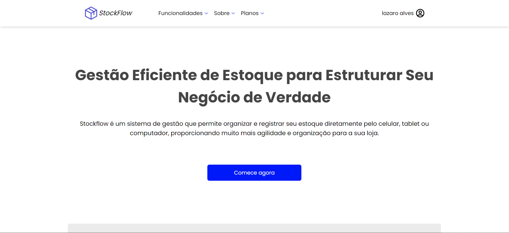

# StockFlow

 

StockFlow é uma aplicação web de gerenciamento de estoque, desenvolvida com Next.js, React.js, TypeScript, e Tailwind CSS. Ela permite que os usuários organizem, acompanhem e administrem seus estoques de forma eficiente.

## Índice

- [Visão Geral](#visão-geral)
- [Funcionalidades](#funcionalidades)
- [Tecnologias Utilizadas](#tecnologias-utilizadas)
- [Instalação](#instalação)
- [Uso](#uso)
- [Estrutura do Projeto](#estrutura-do-projeto)
- [Contribuição](#contribuição)
- [Licença](#licença)

## Visão Geral

StockFlow foi criado para facilitar o gerenciamento de estoque, proporcionando uma interface intuitiva e moderna. A aplicação permite que os usuários criem pastas para organizar seus itens de estoque, além de adicionar, editar, e remover itens de forma simplificada.

## Funcionalidades

- **Organização por Pastas**: Crie pastas para organizar os itens de estoque de acordo com categorias ou tipos.
- **Gerenciamento de Itens**: Adicione, edite, ou exclua itens dentro das pastas criadas.
- **Autenticação de Usuário**: Sistema seguro de autenticação utilizando JWT.
- **Interface Responsiva**: Design responsivo que se adapta a diferentes dispositivos e tamanhos de tela.
- **Busca Rápida**: Função de busca para localizar itens e pastas rapidamente.

## Tecnologias Utilizadas

- **[Next.js](https://nextjs.org/)** - Framework React para renderização do lado do servidor e rotas.
- **[React.js](https://reactjs.org/)** - Biblioteca JavaScript para construção de interfaces de usuário.
- **[TypeScript](https://www.typescriptlang.org/)** - Superconjunto de JavaScript que adiciona tipagem estática ao código.
- **[Tailwind CSS](https://tailwindcss.com/)** - Framework CSS utilitário que permite estilização rápida e eficiente.
